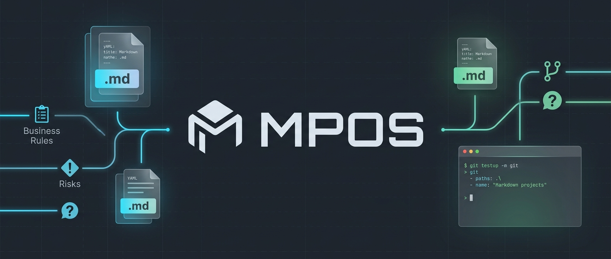

# MPOS — Markdown Project Operating System


MPOS is a **local-first, Git-friendly CLI** for managing a software project's product
documentation and planning artifacts entirely as structured Markdown files. There is no
database and no server-side state — everything lives in your repository as `.md` files
with YAML frontmatter, and MPOS gives you commands (and a local browser IDE) to create,
update, validate, and search them safely.

It's designed so that **humans, your team's tooling, and AI coding assistants** can all
read and edit the same documents without stepping on each other: every document has a
predictable structure, a stable set of `##` sections, and inline markers
(`[BUSINESS_RULE]`, `[OPEN_QUESTION]`, `[RISK]`, etc.) that make important information
easy to find with `mpos search`.

## Key features

- **`mpos init`** scaffolds a complete workspace: living docs (PRD, business rules,
  glossary, architecture, roadmap), planning folders (epics/stories/sprints), task
  boards, decision records, change tracking, and a set of onboarding tutorials.
- **`mpos doc create`** generates new Epics, Stories, Tasks, Sprints, ADRs, Change
  Requests, and Change Reports from templates, with auto-incrementing IDs
  (`EPIC-001`, `STORY-001`, ...).
- **`mpos doc update`** edits a single `##` section (or the `status` field) of a
  document **without touching the rest of the file** — safe for both humans and AI
  tools, and guarded against accidentally renaming/reordering headings.
- **`mpos doc validate`** / **`mpos doctor`** check frontmatter, required sections,
  broken relative links, and duplicate IDs across the whole workspace.
- **`mpos search`** finds documents and inline markers by text, type, or marker name.
- **`mpos ide`** launches a local browser-based IDE: file tree, section-by-section
  editor, live preview, diff view, and a metadata/markers/validation side panel.
- **Git-aware** — `mpos status` and the IDE surface your working-tree status, and
  `mpos doc diff` shows a document's pending changes.

## Installation

Requires **Node.js 18+**.

```bash
git clone <this-repo>
cd "Technical Documnet Round Runner"
npm install
npm run build
```

This compiles TypeScript from `src/` to `dist/`. You can then run the CLI in a few
ways:

```bash
# Directly
node dist/index.js --help

# Or link it globally as `mpos`
npm link
mpos --help
```

During development, you can skip the build step and run the CLI directly from source:

```bash
npm run dev -- --help
```

## Quick start

From an empty (or existing) project directory:

```bash
# 1. Scaffold a new MPOS workspace
mpos init --name "My Project" --description "What this project does" --git-init

# 2. Check that everything is set up correctly
mpos doctor

# 3. Create your first planning documents
mpos doc create epic "Team Workspaces"
mpos doc create story "Create a new workspace" --epic EPIC-001

# 4. See an overview of the project
mpos status

# 5. Open the browser IDE
mpos ide
```

`mpos init` is interactive if you omit `--name`/`--description` — it will prompt you
for a project name and description, then scaffold the workspace without overwriting
any files that already exist.

## Workspace layout

`mpos init` creates the following structure in your project root:

```
.
├── .mpos/
│   ├── config.json          # Project configuration (see below)
│   ├── rules/                # Conventions documents (naming, markdown, planning, AI safety, conflicts)
│   ├── templates/             # Markdown templates used by `mpos doc create`
│   └── examples/              # Worked examples of every document type
├── docs/
│   ├── prd.md                # Product Requirements Document (living doc)
│   ├── business-rules.md     # Canonical list of business rules (living doc)
│   ├── glossary.md           # Shared terminology (living doc)
│   └── architecture.md       # System architecture (living doc)
├── planning/
│   ├── roadmap.md            # Roadmap (living doc)
│   ├── epics/                # EPIC-NNN-*.md
│   ├── stories/              # STORY-NNN-*.md
│   └── sprints/              # SPRINT-NNN-*.md
├── tasks/
│   ├── backlog/              # TASK-NNN-*.md (status = backlog)
│   ├── active/               # TASK-NNN-*.md (status = active)
│   ├── blocked/              # TASK-NNN-*.md (status = blocked)
│   └── done/                 # TASK-NNN-*.md (status = done)
├── decisions/                 # ADR-NNN-*.md (Architecture Decision Records)
├── changes/
│   ├── requests/              # CR-NNN-*.md (Change Requests)
│   └── reports/               # CHG-NNN-*.md (Change Reports)
└── tutorials/                  # 01-07 onboarding guides (read these first!)
```

The five "living docs" (`docs/prd.md`, `docs/business-rules.md`, `docs/glossary.md`,
`docs/architecture.md`, `planning/roadmap.md`) are created once by `mpos init`, have a
fixed `id` equal to their filename (e.g. `id: prd`), and are edited in place with
`mpos doc update` — they are never created via `mpos doc create`.

## Core concepts

### Document types, IDs, and file placement

| Document type    | `type` value      | ID prefix | Directory                       |
|-------------------|--------------------|-----------|----------------------------------|
| Epic              | `epic`             | `EPIC`    | `planning/epics/`                |
| Story             | `story`            | `STORY`   | `planning/stories/`              |
| Task              | `task`             | `TASK`    | `tasks/<status>/`                |
| Sprint            | `sprint`           | `SPRINT`  | `planning/sprints/`              |
| Decision (ADR)    | `decision`         | `ADR`     | `decisions/`                     |
| Change Request    | `change-request`   | `CR`      | `changes/requests/`              |
| Change Report     | `change-report`    | `CHG`     | `changes/reports/`               |
| PRD / Business Rules / Glossary / Architecture / Roadmap | `prd`, `business-rules`, `glossary`, `architecture`, `roadmap` | *(none — fixed `id`)* | `docs/` (and `planning/roadmap.md`) |

- IDs are `<PREFIX>-NNN` (zero-padded to 3 digits), assigned automatically and
  monotonically by `mpos doc create` from counters stored in `.mpos/config.json`.
  IDs are permanent — never reused or renumbered.
- File names follow `<ID>-<slug>.md`, where `<slug>` is a kebab-case form of the
  title (e.g. `EPIC-001-team-workspaces.md`).
- A document's folder must match its `type`/`status`. Moving a Task between
  `tasks/backlog/`, `tasks/active/`, `tasks/blocked/`, and `tasks/done/` should be
  done together with updating its `status` field (e.g. via `mpos doc update --status`).

### Frontmatter

Every managed document starts with a YAML frontmatter block:

```yaml
---
id: STORY-001
title: "Create a new workspace"
type: story
status: ready
owner: ""
created_at: 2026-06-12
updated_at: 2026-06-12
tags: [workspaces]
related:
  - ../epics/EPIC-001-team-workspaces.md
epic: EPIC-001
sprint: SPRINT-001
priority: high
---
```

| Field        | Required | Notes |
|--------------|----------|-------|
| `id`         | yes      | `<PREFIX>-NNN`, or a fixed slug for living docs. |
| `title`      | yes      | Must match the document's `# H1`. |
| `type`       | yes      | One of the document types listed above. |
| `status`     | yes      | See status values below; living docs have no fixed status set. |
| `owner`      | no       | Free text (name, team, or empty string). |
| `created_at` | yes      | `YYYY-MM-DD`, set once. |
| `updated_at` | yes      | `YYYY-MM-DD`, bumped automatically by `mpos doc update`. |
| `tags`       | no       | Array of kebab-case strings. |
| `related`    | no       | Array of **relative paths** to related documents. |
| `epic`       | story/task | ID of the parent epic. |
| `story`      | task only | ID of the parent story. |
| `sprint`     | story/task | ID of the assigned sprint, if any. |
| `priority`   | story/task/decision | One of `critical`, `high`, `medium`, `low`. |

### Status values

| Document type | Allowed `status` values |
|----------------|---------------------------|
| Epic           | `draft`, `planned`, `active`, `done`, `cancelled` |
| Story          | `backlog`, `ready`, `in-progress`, `in-review`, `done`, `blocked` |
| Task           | `backlog`, `active`, `blocked`, `done` |
| Sprint         | `planned`, `active`, `completed`, `cancelled` |
| Decision (ADR) | `proposed`, `accepted`, `rejected`, `superseded` |
| Change Request | `pending`, `approved`, `rejected`, `applied` |
| Change Report  | `final` |

The living docs (PRD, business rules, glossary, architecture, roadmap) do not have a
status workflow.

### Stable sections

Each document type has a fixed set of `##` (top-level) headings defined by its
template in `.mpos/templates/`. These headings are the unit of update for
`mpos doc update --section "<Heading>"`:

- Don't rename or reorder a template-defined `##` heading — add new content as a
  `###` subsection instead, or propose a heading change as a `[DECISION]`.
- Exactly one `# H1` per document, matching `title` in frontmatter.

### Section markers

Use these inline markers in list items so `mpos search --marker <NAME>` (and the IDE's
Markers panel) can find them:

| Marker            | Meaning |
|-------------------|---------|
| `[BUSINESS_RULE]` | A rule the product must enforce — should also appear in `docs/business-rules.md`. |
| `[OPEN_QUESTION]` | Something unresolved that may block planning or implementation. |
| `[CONFLICT]`      | A detected/suspected contradiction with another document. |
| `[DECISION]`      | A decision made inline; significant decisions should also get their own ADR. |
| `[ASSUMPTION]`    | Something assumed true but not verified. |
| `[RISK]`          | A risk to delivery, quality, or correctness. |
| `[TODO]`          | An outstanding action item not yet tracked as a Task. |

Syntax — a bold tag at the start of a list item, with an optional local ID:

```markdown
- **[BUSINESS_RULE]** Workspace names must be unique within an organization.
- **[OPEN_QUESTION]** (OQ-1) Should free-tier orgs be limited to 1 workspace?
- **[RISK]** Migrating existing single-workspace accounts may require downtime.
```

### Links

Use relative Markdown links between documents (e.g.
`[EPIC-001](../epics/EPIC-001-team-workspaces.md)`), optionally with a heading anchor
(`#workspace-limits`). `mpos doc validate` and `mpos doctor` check that every relative
link resolves to a file that exists.

## CLI reference

Global options (available on every command):

```
-V, --version    output the version number
--debug          print stack traces on errors
--silent         suppress non-error output
-h, --help       display help for command
```

### `mpos init`

Initialize an MPOS workspace in the current directory.

```bash
mpos init [-n|--name <name>] [-d|--description <description>] [--git-init] [--dry-run]
```

- `-n, --name <name>` — project name (prompted if omitted).
- `-d, --description <description>` — project description (prompted if omitted).
- `--git-init` — initialize a Git repository if one doesn't already exist.
- `--dry-run` — preview which files would be created without writing anything.

Existing files are never overwritten. If `.mpos/config.json` already exists, you'll be
asked whether to continue.

### `mpos doctor`

Run a full workspace health check.

```bash
mpos doctor
```

Checks that `.mpos/config.json` exists, that all required directories
(`docs`, `planning`, `tasks`, `decisions`, `changes`, `tutorials`, `.mpos/rules`,
`.mpos/templates`, `.mpos/examples`) and required living docs
(`docs/prd.md`, `docs/business-rules.md`, `docs/glossary.md`, `docs/architecture.md`)
are present, validates every document, and checks for duplicate IDs. Prints a summary
table of critical/warning/info findings and exits with a non-zero code if any
**critical** findings exist.

### `mpos status`

Print a project overview.

```bash
mpos status
```

Shows the project name, counts of planning documents by type/status, the active
sprint (if any), the current validation summary (critical/warning/info), and the
working tree's Git status (branch, staged/unstaged/untracked file counts).

### `mpos doc create`

Create a new document from a template.

```bash
mpos doc create <type> <title> [--epic <EPIC-ID>] [--story <STORY-ID>]
                                [--owner <owner>] [--priority <priority>] [--dry-run]
```

- `<type>` — one of `epic`, `story`, `task`, `sprint`, `decision`, `change-request`,
  `change-report`.
- `<title>` — the document's title (used for `# H1`, `title` in frontmatter, and the
  file's slug).
- `--epic <EPIC-ID>` — **required** when `<type>` is `story`. Links the new story to
  its parent epic.
- `--story <STORY-ID>` — **required** when `<type>` is `task`. Links the new task to
  its parent story (its `epic` is inherited from the story unless `--epic` is also
  given).
- `--owner <owner>` — sets the `owner` frontmatter field (default: empty).
- `--priority <priority>` — one of `critical`, `high`, `medium`, `low` (default:
  `medium`).
- `--dry-run` — preview the file that would be created (with a placeholder `XXX` ID)
  without writing it or incrementing any counters.

Examples:

```bash
mpos doc create epic "Team Workspaces"
mpos doc create story "Create a new workspace" --epic EPIC-001 --priority high
mpos doc create task "Implement workspace creation API" --story STORY-001
mpos doc create sprint "Sprint 1 — Workspace Foundations"
mpos doc create decision "Use PostgreSQL as primary datastore"
mpos doc create change-request "Add SSO login support"
mpos doc create change-report "Add SSO login support"
```

> `prd`, `business-rules`, `glossary`, `architecture`, and `roadmap` are **not**
> created with `doc create` — they're scaffolded once by `mpos init` and edited in
> place with `mpos doc update`.

### `mpos doc update`

Update a single section and/or the status of an existing document.

```bash
mpos doc update --id <ID> [--section <Heading>] [--text <text> | --file <path>]
                [--append] [--status <status>] [--force]
```

- `--id <ID>` — **required**. The document's ID (e.g. `STORY-001`).
- `--section <Heading>` — the exact `##` heading to update (must already exist in the
  document unless `--force` is used).
- `--text <text>` — new content for the section (required with `--section`, unless
  `--file` is given).
- `--file <path>` — read the new section content from a file instead of `--text`.
- `--append` — append the new content to the existing section instead of replacing
  it.
- `--status <status>` — update the `status` frontmatter field (must be a valid value
  for the document's type).
- `--force` — allow changes that would otherwise be rejected, such as a heading-set
  change or an `id`/`type` change. Use with care — this bypasses the AI-safety
  guardrails described in `.mpos/rules/ai-safety-rules.md`.

At least one of `--section` or `--status` must be given. On success, `updated_at` is
bumped to today's date and only the targeted section (and/or frontmatter field) is
changed — the rest of the file is left byte-for-byte identical.

Examples:

```bash
mpos doc update --id STORY-001 --section "Summary" --text "Updated summary text."
mpos doc update --id STORY-001 --section "Acceptance Criteria" --file ./ac.md --append
mpos doc update --id STORY-001 --status in-progress
```

### `mpos doc validate`

Validate one or all documents.

```bash
mpos doc validate [id]
```

- `[id]` — optional. If given, validates only that document; otherwise validates
  every document in the workspace and also checks for duplicate IDs.

Checks frontmatter schema, required sections (against the document's template),
broken relative links, and (when validating the whole workspace) duplicate IDs. Prints
a summary table and exits with a non-zero code if any critical findings exist.

### `mpos doc diff`

Show a document's pending Git changes.

```bash
mpos doc diff --id <ID> [--staged]
```

- `--id <ID>` — **required**. The document's ID.
- `--staged` — show the staged diff instead of the working-tree diff.

### `mpos search`

Search documents and inline markers.

```bash
mpos search <query> [--type <type>] [--marker <name>] [--json]
```

- `<query>` — text to search for in titles and content.
- `--type <type>` — restrict to a document type (e.g. `story`, `task`).
- `--marker <name>` — restrict to documents containing a given marker (e.g.
  `OPEN_QUESTION`, `RISK`).
- `--json` — output results as JSON instead of human-readable text.

Each text result is printed as `id title (path)` followed by a matching snippet.

### `mpos ide`

Launch the local browser IDE.

```bash
mpos ide [--port <port>] [--host <host>]
```

- `--port <port>` — port to listen on (default: `ide.default_port` from
  `.mpos/config.json`, normally `4317`). If the port is in use, MPOS automatically
  tries subsequent ports.
- `--host <host>` — host to bind to (default: `ide.host` from
  `.mpos/config.json`, normally `localhost`).

Prints `MPOS IDE running at http://<host>:<port>` and opens your browser automatically
if `ide.auto_open_browser` is `true`. Press `Ctrl+C` to stop the server.

## The Web IDE

`mpos ide` serves a local, single-page browser app (no external network calls) backed
by the same read/write logic as the CLI:

- **File tree** — every managed document, grouped by folder, with type icons and
  "modified" indicators from Git status. Filterable by name, ID, or status.
- **Editor** — each `##` section is its own editable block with dirty-state tracking,
  an inline diff preview, and Edit / Preview / Split view modes.
- **Outline** — quick navigation between sections, with marker indicators.
- **Status** — for document types with a status workflow, an inline dropdown that
  saves immediately on change; fixed/living docs show a read-only status badge.
- **Side panel** — five tabs: **Metadata** (frontmatter), **Related** (linked
  documents, resolved against the file tree), **Markers** (all
  `[BUSINESS_RULE]`/`[RISK]`/etc. markers in the doc, grouped by type), **Validation**
  (live validation results for the open document), and **Changes** (the document's
  working-tree Git diff).

All edits go through the same section-update logic as `mpos doc update`, so the same
heading-stability and frontmatter guardrails apply.

## Configuration: `.mpos/config.json`

```json
{
  "version": "1.0.0",
  "project": {
    "name": "my-project",
    "description": "",
    "created_at": "2026-06-12"
  },
  "ide": {
    "default_port": 4317,
    "host": "localhost",
    "auto_open_browser": true
  },
  "git": {
    "enabled": true,
    "auto_commit": false,
    "commit_prefix": "mpos:",
    "default_branch": "main",
    "tag_on_milestone": false
  },
  "paths": {
    "docs": "docs",
    "planning": "planning",
    "tasks": "tasks",
    "decisions": "decisions",
    "changes": "changes",
    "templates": ".mpos/templates",
    "rules": ".mpos/rules",
    "examples": ".mpos/examples",
    "tutorials": "tutorials"
  },
  "counters": {
    "epic": 0,
    "story": 0,
    "task": 0,
    "sprint": 0,
    "decision": 0,
    "change_request": 0,
    "change_report": 0
  },
  "validation": {
    "require_frontmatter": true,
    "require_owner": false,
    "fail_on_broken_links": true,
    "fail_on_duplicate_ids": true
  }
}
```

- `project` — your project's name/description, shown in `mpos status` and the IDE
  header.
- `ide` — default port/host for `mpos ide`, and whether it opens your browser
  automatically.
- `git` — Git integration settings (currently used for status/diff reporting;
  `auto_commit`/`tag_on_milestone` are reserved for future use).
- `paths` — relative paths to each managed area of the workspace. Only change these
  if you also move the corresponding folders.
- `counters` — the next ID number for each document type. **Never edit these by
  hand** — they're incremented automatically by `mpos doc create`.
- `validation` — toggles for what `mpos doc validate`/`mpos doctor` enforce.

You can override any bundled template by placing a file with the same name under
`.mpos/templates/` in your workspace — `mpos doc create` prefers project-local
templates over the built-in ones.

## AI-safe editing

MPOS is designed to be edited by AI tools as well as humans. `mpos doc update` (and
the IDE, which uses the same code path) refuses to:

- Change a document's `id` or `type`.
- Add, remove, rename, or reorder a template-defined `##` heading.

...unless `--force` is explicitly passed. This keeps section-level diffs small and
predictable, so both AI assistants and humans can safely make targeted edits. See
`.mpos/rules/ai-safety-rules.md` (created by `mpos init`) for the full policy.

## Tutorials

`mpos init` scaffolds a `tutorials/` folder with onboarding guides — open these from
the IDE's "Tutorials & onboarding" link, or read them directly:

1. `01-getting-started.md` — your first `mpos` commands.
2. `02-how-docs-work.md` — frontmatter, sections, and markers.
3. `03-how-planning-works.md` — epics, stories, tasks, and sprints.
4. `04-how-change-management-works.md` — change requests and reports.
5. `05-how-conflicts-work.md` — the `[CONFLICT]` marker and resolving contradictions.
6. `06-how-browser-ide-works.md` — using `mpos ide`.
7. `07-ai-safe-usage.md` — guidelines for AI tools editing the workspace.

## Development

```bash
npm install        # install dependencies
npm run build       # compile src/ -> dist/ with tsc
npm run dev -- ...   # run the CLI from source via ts-node
npm test             # run the Vitest test suite once
npm run test:watch   # run tests in watch mode
npm run lint         # run eslint over src/
npm run clean        # remove dist/
```

## License

MIT
